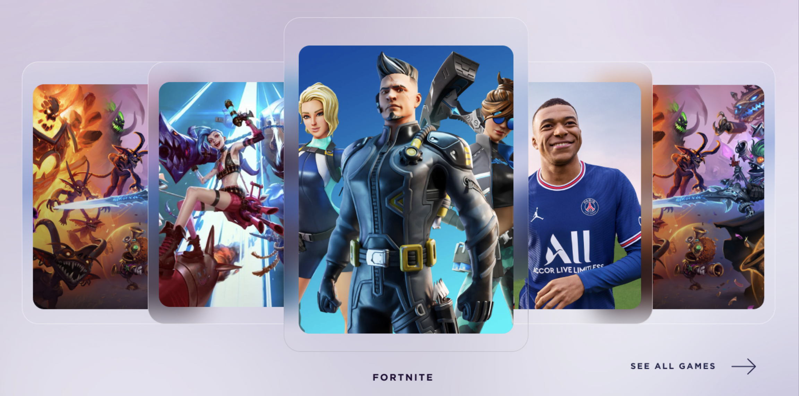

This project was bootstrapped with [Create React App](https://github.com/facebook/create-react-app), using the [Redux](https://redux.js.org/) and [Redux Toolkit](https://redux-toolkit.js.org/) template.

# Shibnobi Gaming Coding Challenge

## Overview

Use the below mockup to create a carousel that displays all the game options. The mockup and all necessary assets are located in the `/src/assets` directory.

## Instructions

1. Fetch the games data by making a request to our API at https://qa-dubbz.com/api/v1/public/games and store the data in the redux store. Both the store and initial `gamesReducer` have been configured using the `@reduxjs/toolkit` library. You may use this existing configuration (which is quite similar to what we use in production) or you may configure the store yourself using other libraries. 
2. Create the `GamesCarousel` component to display the games received from the API. The component should meet the following requirements:
    * It should show five games at a time.
    * It should scroll to the right automatically to display the next game option every 3 seconds.
    * It should show the name of the game in the center, as shown in the mockup.
3. Style the `GamesCarousel` component. We use the `styled-components` library and have included it in this repo, but you do not need to use it. Some things to keep in mind:
    * The styles do NOT need to be cross-browser compatible. I would recommend using Chrome for this mockup as Firefox does not support some CSS properties that facilitate this design.
    * The styles do NOT need to be responsive.

### Bonus (Optional): 

1. Add tests. The basic reducer and component tests have already been setup using `@testing-library` and `jest`. 
2. Add cross-broswer support for Firefox. Firefox does not currently support certain CSS properties that facilitate this design. Get creative and stray from the mockup if you want to or need to!
3. Add animations - whatever you think looks good!
